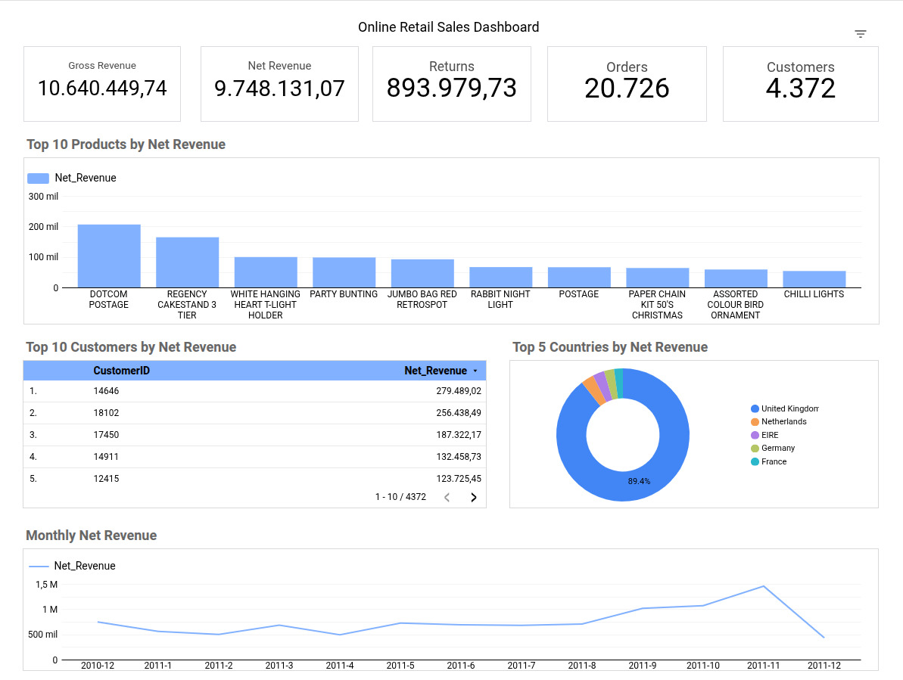

# 🚀 Retail Data Platform — Databricks

End-to-end retail data pipeline built with **Databricks, PySpark, Delta Lake, SQL and Looker Studio**, following a **Bronze → Silver → Data Quality → Gold** architecture.

The project processes the **Online Retail dataset**, transforms raw transactional data into reliable analytical data, applies data quality validation rules, generates business-ready Gold tables, and exposes the results through an interactive sales dashboard.

The pipeline is orchestrated using **Databricks Jobs**, with scheduled execution and task dependencies.

---

## 📌 Project Overview

The objective of this project was to build a data platform for transforming raw retail transactions into reliable, business-ready analytical data.

The pipeline demonstrates an end-to-end data engineering workflow, from raw data ingestion to data cleaning, validation, analytical transformations, dashboarding, and automated orchestration.

---

## 🏗️ Architecture

```text
Online Retail Source
        │
        ▼
     CSV Files
        │
        ▼
   ┌──────────┐
   │  BRONZE  │
   │ Raw Data │
   └─────┬────┘
         │
         ▼
   ┌────────────┐
   │   SILVER   │
   │ Clean Data │
   └─────┬──────┘
         │
         ▼
 ┌─────────────────┐
 │  DATA QUALITY   │
 │   Validation    │
 └────────┬────────┘
          │
          ▼
 ┌─────────────────┐
 │      GOLD       │
 │ Business Data   │
 └───────┬─────────┘
         │
         ▼
  Sales Dashboard

```
---

## 🔄 Data Pipeline

## 🥉 01 — Bronze

The source data is exported into CSV files and stored in a **Databricks Volume**.

The CSV files are then read using Spark and ingested into the Bronze layer.

The Bronze table contains the complete source dataset:

**541,909 records**

The Bronze layer preserves the original dataset and serves as the raw input for the downstream transformations.

---

## 🥈 02 — Silver

The Silver layer contains cleaned and transformed transactional data.

### Main transformations

- Remove exact duplicate records
- Remove records with invalid negative prices
- Remove zero-quantity records
- Preserve return transactions
- Create transaction type
- Create date attributes
- Calculate transaction totals

### New columns include:

- TransactionType
- Date
- Year
- Month
- Day
- Total

The resulting Silver table contains:

**536,639 records**

The removed records correspond to:

- 5,268 exact duplicates
- 2 records with negative UnitPrice

Valid return transactions are **not removed** from the dataset because they are required to calculate return values and net revenue.

---

## 🧪 03 — Data Quality

A dedicated Data Quality step validates the Silver layer before the Gold layer is generated.

The validation process checks for critical data issues, including:

- Negative UnitPrice values
- Zero-quantity transactions
- Negative quantities / return transactions
- Null CustomerID values
- Exact duplicate records
- Invalid transaction totals

The pipeline only proceeds to the Gold layer when the critical data quality checks pass.

This separates **data transformation** from **data validation**, making the pipeline easier to monitor and maintain.

---

## 🥇 04 — Gold

The Gold layer contains business-ready tables designed for analytical consumption.

#### 📅 Monthly Sales

Contains monthly sales performance metrics:
- Gross Revenue
- Returns
- Net Revenue
- Orders
- Units Sold

This table is used to analyze revenue trends over time.

---

#### 🗓️ Daily Sales

Provides the same core business metrics at daily granularity:

- Gross Revenue
- Returns
- Net Revenue
- Orders
- Units Sold

This table allows more detailed analysis of daily sales performance.

---

#### 🌍 Sales by Country

Provides sales performance by country, including:

- Gross Revenue
- Returns
- Net Revenue
- Orders
- Units Sold

---

#### 🏷️ Sales by Product

Provides product-level performance including:

- Gross Revenue
- Returns
- Net Revenue
- Units Sold
- Orders

The complete product dataset is retained in Gold, while Top N products are selected at the dashboard level for visualization.

---

#### 👥 Sales by Customer

Provides customer-level sales performance including:

- Gross Revenue
- Returns
- Net Revenue
- Units Sold
- Orders

This table supports customer-level revenue and purchasing analysis.

---

#### 🏆 Overall KPIs

Contains the main business KPIs:

- Gross Revenue
- Returns
- Net Revenue
- Orders
- Customers
- Units Sold
- Average Line Value
- Average Net Order Value

---

## 📊 Dashboard

The Gold tables are used to build an interactive retail sales dashboard in Looker Studio.

The dashboard provides a business-oriented view of the processed data rather than exposing the raw transactional layer.

### Main Dashboard Metrics
- Gross Revenue
- Net Revenue
- Returns
- Orders
- Customers
### Main Visualizations
- Top 10 Products by Net Revenue
- Top 10 Customers by Net Revenue
- Top 5 Countries by Net Revenue
- Monthly Net Revenue Trend

The dashboard uses the complete Gold datasets while applying Top N filters at the visualization level.



---

## ⏱️ Orchestration

The complete pipeline is orchestrated using **Databricks Jobs**.

The workflow contains four dependent tasks:

```text
01_Ingestion
      │
      ▼
02_Silver
      │
      ▼
03_Data_Quality
      │
      ▼
04_Gold
```

Each task runs only after its upstream dependency has completed successfully.

The Job is configured with **scheduled execution**, allowing the complete pipeline to run automatically without manual intervention.

Recent scheduled executions completed successfully.

---

## 📈 Pipeline Results

The final pipeline transforms the complete raw dataset into validated and business-ready analytical data.

```text
Bronze
541,909 records
      │
      ▼
Silver
536,639 records
      │
      ▼
Data Quality
Validation
      │
      ▼
Gold
Business-ready analytical tables
      │
      ▼
Looker Studio
Sales Dashboard
```
---

## 🛠️ Technologies

- Databricks
- Apache Spark / PySpark
- Delta Lake
- SQL
- Python
- Looker Studio
- Databricks Jobs


